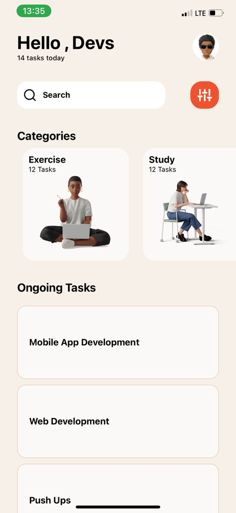

#rn-assignment3-11333031

## Task Manager App

## Description
This is a task manager application built with React Native. It includes categories such as Exercise, Study, Code, and Cook, and allows users to manage ongoing tasks.

## Components
- **Category**: Displays a category with an icon and name.
- **Task**: Displays a task with a title and description.
- **TaskList**: Renders a list of tasks using FlatList.
- **HomeScreen**: Displays the list of categories.
- **CategoryScreen**: Displays tasks for a selected category and allows adding new tasks.

## Screenshots
[]